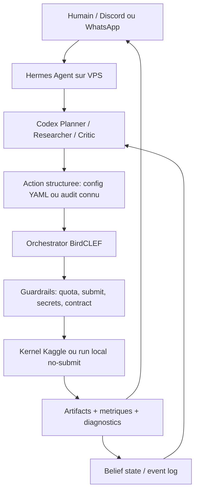

# Guide agentic Kaggle pour le pipeline Hermes + Codex de BirdCLEF

Date : 2026-05-25  
Portee : adaptation operationnelle de la discussion *Autonomous Kaggle Agent: Architecture & Strategy* au projet BirdCLEF 2026 existant.

## TL;DR

La discussion Claude Opus 4.6 / GPT-5.5 ne recommande pas un LLM qui improvise du code Kaggle en continu. Elle recommande un systeme de recherche reproductible :

```text
planner propose une action structuree
-> executor lance une experience deterministe
-> auditor attaque le resultat
-> registry enregistre les faits
-> planner decide avec un budget borne
```

Pour BirdCLEF, ce principe reste pertinent, mais le MVP tabulaire de la discussion ne se transpose pas directement. Le pipeline est audio, soumis a un domain shift `train_audio` / `soundscapes`, a des modeles d'embeddings et SED, a des blends/post-traitements et a une validation difficile.

Le projet local possede deja la bonne ossature :

- VPS CPU pour orchestrer ;
- execution lourde via kernels Kaggle ;
- `configs/experiments/*.yaml` comme catalogue d'actions ;
- `state/`, `reports/` et `knowledge/` pour l'etat et les preuves ;
- `swarm/hermes_client.py` pour appeler Hermes puis Codex en roles `researcher`, `critic`, `planner` ;
- garde-fous de soumission et quota ;
- pipeline actuellement en pause dans le snapshot local du 2026-05-14, avec une frontier mesuree a `0.947`.

Le prochain niveau n'est donc pas de rajouter plus d'autonomie. Il est de rendre la decision agentique mesurable, audio-specifique et robuste aux erreurs de contexte.

## Ce qui vient de la discussion source

### Principes a conserver

1. Le LLM doit planifier, pas executer librement des scripts arbitraires.
2. La validation est une hypothese a tester, pas un reglage choisi une fois.
3. Les hypotheses doivent produire des tests executables, pas seulement des commentaires.
4. L'historique et les preuves doivent vivre dans un registre persistant, pas uniquement dans le contexte du LLM.
5. Le planner doit etre compare a des baselines non LLM sous le meme budget.
6. Le score final ne suffit pas : il faut attribuer les echecs a l'execution, la validation, la recherche, l'audit ou la politique de soumission.
7. Pour les modalites complexes, il faut un agent specialise au-dessus d'un OS Kaggle commun.
8. Le mode humain-dans-la-boucle est normal pour les decisions a fort impact.

### Elements a ne pas reprendre tels quels

La discussion propose d'abord un MVP tabulaire avec CatBoost, LightGBM et XGBoost. Pour BirdCLEF, ce playbook est hors sujet comme boucle principale. Les briques equivalents sont :

| Discussion tabulaire | Equivalent BirdCLEF |
|---|---|
| Feature templates tabulaires | segmentation audio, embeddings PERCH, SED, sequence models, priors explicites |
| Random/group/time split | split site/recording/soundscape, controle du domain shift et du prior site x heure |
| Train/test drift | shift clean audio vers soundscapes, bruit, activite polyphonique, distribution temporelle/site |
| Schema/prediction checks | `row_id`, ordre `sample_submission`, classes, artefacts hidden-test vs `BC2026_Train_*` |
| Model family sweep | PERCH/ProtoSSM/ResidualSSM, SED, parents orthogonaux, blends causaux |

## Etat du pipeline BirdCLEF lu localement

Ce guide s'appuie sur les fichiers presents dans le repo, pas sur une verification distante du VPS ou du leaderboard au-dela de ces artefacts.

### Architecture existante

```text
VPS CPU
  orchestrator/              boucle, state, guardrails, polling Kaggle
  swarm/hermes_client.py     Hermes -> Codex, roles researcher/critic/planner
  configs/experiments/       actions YAML autorisees
  state/                     runtime, queue, families, recommendations
  knowledge/ + reports/      faits, audits, decisions

Kaggle GPU / kernels
  training ou inference
  output submission.csv
  score LB uniquement apres action autorisee
```

### Faits strategiques recents presents dans `knowledge/project_state.md`

- Frontier locale reportee au 2026-05-14 : `0.947`.
- Le micro-blend `Model_9/Model_62 = 0.995/0.005` est mesure neutre a `0.947`.
- `exp47` et `exp48` ont isole la trajectoire seed : `seed=42` reproduit EXP-42, tandis que la trajectoire utile est liee a `seed=4`.
- La prochaine action defendable indiquee par l'etat est `no-submit`, autour de nouvelles trajectoires ProtoSSM/ResidualSSM ou d'un parent orthogonal, pas une nouvelle soumission.
- Un refresh Hermes a echoue sur rate limit Codex (`429`) et son fallback stale doit etre ignore.

### Ce que le pipeline fait deja correctement

- `auto_submit` est encadre et les soumissions demandent validation explicite.
- Les experiences sont des specs YAML et non des idees flottantes dans un chat.
- Le client Hermes compacte deja le packet transmis aux roles.
- Le repo possede des audits no-submit et une logique de familles d'experiences.
- Les prompts imposent d'eviter les clones de parents deja mesures et de traiter les sidecars invalides comme non soumettables.

## Architecture cible pour ce projet



### Repartition des roles

| Composant | Responsabilite recommandee | Ne doit pas faire |
|---|---|---|
| Hermes Agent | Interface persistante, scheduling, notifications, appel Codex, skills/runbooks | Decider a partir de memoires non synchronisees avec l'etat |
| Codex via Hermes | Interpreter le packet, critiquer une hypothese, choisir une action autorisee, maintenir le code avec tests | Soumettre directement ou generer une nouvelle lane complexe sans contrat |
| VPS orchestrator | Source operationnelle des runs, queue, budgets, polling, reports | Se fier a un resume LLM comme source de verite |
| Kaggle kernels | Executer training/inference et produire artefacts | Choisir la strategie suivante |
| Humain | Autoriser submit/GPU risquable, arbitrer pivot et nouvelle famille | Micromanager chaque run no-submit valide |

### Point de vigilance sur "Codex comme LLM"

Le projet actuel utilise Hermes avec le provider `openai-codex` et des modeles configures dans `configs/orchestrator.example.yaml`. Cette integration est deja votre contrat pratique. Il faut la traiter comme une interface d'agent outille, pas comme l'hypothese que n'importe quel endpoint generatif expose les memes capacites.

Regle de design :

```text
Hermes/Codex produit une recommendation JSON.
L'orchestrator accepte uniquement des actions connues et validees.
Le kernel execute.
Le state enregistre.
```

## Adaptations prioritaires au pipeline actuel

### P0 - Faire du state structure la verite strategique

Le repo est riche en Markdown et packets. C'est utile pour la lecture humaine, mais dangereux si le planner voit des recommandations devenues stale apres un nouveau score ou un incident Hermes.

Objectif :

- garder `knowledge/*.md` pour les rapports ;
- maintenir une vue canonique machine-readable des faits actifs ;
- generer le packet Hermes depuis cette vue et les artefacts, pas depuis une accumulation de prose.

Schema minimal propose :

```json
{
  "frontier": {
    "public_lb": 0.947,
    "source": "latest_verified_submission",
    "verified_at": "2026-05-14"
  },
  "active_decision": {
    "submit_allowed": false,
    "recommended_mode": "no_submit",
    "closed_directions": ["micro_blend_model9_model62"],
    "open_directions": ["protossm_seed4_trajectory", "orthogonal_parent"]
  },
  "risks": [
    "codex_provider_rate_limit",
    "stale_fallback_recommendation",
    "soundscape_domain_shift",
    "public_lb_overfit"
  ]
}
```

Implementation future probable :

- etendre `state_store.py` avec `belief_state.json`, ou passer a SQLite/DuckDB ;
- produire ce state a partir de `state/history/runs.jsonl`, audits et scores ;
- inclure le state structure avant les packets Markdown dans `swarm/contracts.py`.

### P0 - Ne jamais laisser un rate limit changer la strategie

Le snapshot local contient deja un cas ou Hermes/Codex a renvoye une recommendation fallback stale apres `429`.

Politique :

```text
si provider indisponible:
  ne pas inventer une nouvelle experience
  ne pas armer une soumission
  garder la pipeline en pause ou continuer seulement un run deja autorise
  journaliser agent_unavailable avec timestamp et decision gelees
```

Une indisponibilite LLM est un incident d'orchestration, pas un signal ML.

### P1 - Transformer les hypotheses audio en accusations testables

Le trio `researcher/critic/planner` est utile seulement si chaque recommendation produit une variable isolee et un critere de decision.

Exemples BirdCLEF :

| Hypothese | Test no-submit ou borne | Signal decisionnel |
|---|---|---|
| Le gain vient de la seed/trajectoire ProtoSSM | reruns controles sur seeds fixes, memes artefacts/input | stabilite du delta par seed et distribution par taxon |
| Le prior site x heure aide vraiment | ablation identique avec/sans prior sur sorties compatibles | gain robuste sans degradation par site |
| Une lane SED est complementaire a PERCH | comparer erreurs/per-class logits puis blend causal | complementarite mesurable, pas simple score voisin |
| Le parent public ne se reproduit pas a cause de la stochasticite | hash artefacts, seed, environnement, output diff | delta explique avant tout child |
| L'output n'est pas soumettable | contract audit sur `row_id` et sample submission | blocage automatique du submit |

### P1 - Construire un auditor specialise audio

Les audits generiques leakage/schema de la discussion doivent devenir des tests BirdCLEF :

#### Contrat d'inference et de soumission

- `row_id` identiques au `sample_submission` ;
- aucune ligne `BC2026_Train_*` dans un artefact destine au LB ;
- colonnes de taxons identiques et ordonnees ;
- aucune valeur `NaN` ou infinie ;
- distribution des scores comparee au parent ;
- hash des artefacts, seed, environnement et sources conserves.

#### Robustesse audio et domain shift

- distinction `train_audio` vs `labelled_soundscapes` vs test soundscapes ;
- scores/diagnostics segmentes par site, heure et type d'enregistrement lorsque disponibles ;
- tests de sensibilite au bruit, fenetre, overlap et TTA ;
- analyse per-class, surtout pour les gains portes par peu de taxons ;
- controle des priors site/heure en ablation explicite ;
- recherche de doublons/near-duplicates ou fuites de metadata uniquement si conforme aux regles.

#### Validation

La metrique publique ne valide pas une histoire causale. Conserver :

- un proxy OOF clairement etiquete comme proxy ;
- des ablations mono-variable ;
- la distinction entre signal LB et preuve de generalisation ;
- une politique stricte : une submission doit tester une hypothese identifiee.

### P1 - Evaluer le planner, pas uniquement les modeles

Le point le plus important de la discussion est absent si l'on se contente d'obtenir un score BirdCLEF : faut-il attribuer la progression au planner ou seulement a des notebooks publics forts ?

Ajouter, pour chaque decision :

```json
{
  "observed_state_id": "state_snapshot_id",
  "candidate_actions": ["seed_probe", "orthogonal_parent", "submit_micro_blend"],
  "selected_action": "seed_probe",
  "planner_source": "hermes_codex",
  "expected_information": "isolate ProtoSSM seed trajectory",
  "expected_cost": {"kaggle_run": 1, "submission": 0},
  "actual_result": "seed42_reproduces_exp42",
  "decision_quality": "informative_no_submit"
}
```

Baselines a comparer sur le meme etat :

- planner Codex/Hermes ;
- heuristique codifiee : fermer clones neutres, prioriser actions no-submit mono-variable ;
- planner bandit simple sur familles `seed`, `parent_orthogonal`, `postprocessing`, `blend` ;
- choix humain lors des checkpoints importants.

Le test utile n'est pas : "Codex a-t-il propose quelque chose d'intelligent ?"  
Le test utile est : "a budget identique, choisit-il plus souvent l'action qui elimine une mauvaise direction ou ouvre un gain reel ?"

### P2 - Garder la generation de code sous contrat

La discussion autorise l'ajout de code genere plus tard, a condition qu'il entre par une interface testable. BirdCLEF a deja du code specialise ; ne pas laisser le planner modifier directement une inference de competition avant les gates.

Tout nouveau bloc propose par Codex doit passer :

- test jouet ou smoke test ;
- run no-submit ;
- contract audit `submission.csv` ;
- comparaison monovariable au parent ;
- reproductibilite avec seed et hash ;
- revue humaine avant toute soumission si le changement est strategique.

Types de composants acceptables plus tard :

```text
new_audio_transform
new_postprocessing_block
new_validation_probe
new_parent_wrapper
```

Pas acceptable en premiere intention :

```text
"reecris le notebook gagnant et soumets-le"
```

## Boucle operationnelle recommandee pour BirdCLEF

```text
1. Lire state canonique et dernier audit.
2. Verifier que le pipeline est pause ou qu'un run actif est suivi.
3. Construire un packet compact avec frontier, hypotheses, risques, budget.
4. Faire produire par Hermes/Codex une recommendation structuree.
5. Refuser toute action inconnue, stale, multi-variable ou soumission non autorisee.
6. Executer un run no-submit ou un kernel autorise.
7. Auditer contrat, stabilite, delta et cout.
8. Mettre a jour state, journal et report.
9. Soumettre seulement si l'hypothese et l'accord humain sont explicites.
10. Postmortem : quelle direction a ete ouverte ou fermee ?
```

## Contrat de recommendation conseille

Le schema JSON du planner actuel est deja proche du besoin. Les champs suivants le rendraient plus evaluable :

```json
{
  "action_type": "run_existing_experiment",
  "experiment_id": "exp_candidate_id",
  "hypothesis_id": "hyp_protossm_seed_trajectory",
  "isolated_variable": "seed",
  "parent_reference": "verified_frontier_or_parent_id",
  "expected_information_gain": "high",
  "expected_score_upside": "unknown",
  "budget": {
    "gpu_hours_estimate": 0.0,
    "submission_cost": 0
  },
  "gates": [
    "no_submit",
    "submission_contract_audit",
    "artifact_hash_recorded"
  ],
  "stop_condition": "close direction if output matches closed parent or has no causal delta"
}
```

## Deployment Hermes + Codex + VPS : conventions a conserver

### Ce qui est deja conforme

- Le VPS orchestre et ne porte pas necessairement le calcul lourd.
- Hermes est installe via `scripts/setup_hermes.sh`.
- `swarm/hermes_client.py` appelle Hermes avec le provider `openai-codex`.
- Kaggle CLI fournit les operations de competitions, kernels et submissions.
- Les services systemd et la separation `state/logs/reports` existent.

### Recommandations de securite et exploitation

- Ne jamais exposer les fichiers d'identifiants Kaggle, `.env` ou credentials Hermes dans les packets LLM.
- Garder la soumission sous approbation humaine explicite.
- Ne pas lancer Hermes avec des approbations dangereuses desactivees sur un agent pilotant Kaggle et des secrets.
- Utiliser un profil Hermes dedie par competition lors d'un nouveau challenge ; pour BirdCLEF, conserver le profil et l'etat existants sans les melanger a une nouvelle competition.
- Faire de `hermes doctor` / statut d'auth un preflight avant une boucle autonome longue.
- En cas de `429`, timeout ou output JSON invalide : aucune nouvelle decision strategique automatique.

## Roadmap cible pour ameliorer ce pipeline

### Etape 1 - Stabiliser la source de verite

- Ajouter une vue state machine-readable pour frontier, actions fermees, hypotheses actives et incidents provider.
- Re-generer les resumes Hermes a partir de cette vue.
- Tester qu'une recommendation stale ne peut pas rouvrir une direction fermee.

### Etape 2 - Instrumenter la qualite de decision

- Journaliser actions candidates, action choisie, cout attendu, preuve obtenue et direction fermee/ouverte.
- Implementer une heuristique baseline sans LLM.
- Rejouer retrospectivement quelques decisions `exp42` a `exp48`.

### Etape 3 - Renforcer les auditors audio

- Consolider les audits de contrat de soumission.
- Ajouter diagnostics per-class et delta de distributions.
- Formaliser les audits seed/runtime/source pour ProtoSSM/ResidualSSM.
- Formaliser une gate de complementarite avant tout blend.

### Etape 4 - Reactiver une exploration controlee

Conditions minimales :

- auth Hermes/Codex valide ;
- state sans recommendation stale ;
- action no-submit mono-variable choisie ;
- budget expose ;
- aucune soumission automatique.

Sur l'etat local du 2026-05-14, la direction coherentement ouverte est :

```text
exploration no-submit d'une trajectoire ProtoSSM/ResidualSSM liee a seed=4
ou parent vraiment orthogonal,
pas un renforcement du micro-blend deja neutre.
```

## Checklist avant une prochaine boucle Hermes

- [ ] Lire le dernier `project_state` et le dernier report d'audit.
- [ ] Confirmer l'etat reel VPS avant de sortir de pause.
- [ ] Verifier l'auth Hermes/Codex et l'absence de rate limit.
- [ ] Charger la frontier la plus recente (`0.947` dans le snapshot local lu).
- [ ] Bloquer les directions closes et recommendations stale.
- [ ] Choisir une variable isolee avec un resultat falsifiable.
- [ ] Estimer cout GPU/Kaggle et submission cost.
- [ ] Forcer `no-submit` sauf autorisation explicite.
- [ ] Auditer output, hashes et contrat de soumission.
- [ ] Enregistrer ce que l'experience a appris, meme en cas de score nul.

## Sources

### Discussion synthétisee

- [Autonomous Kaggle Agent: Architecture & Strategy - discussion Claude Opus 4.6 / GPT-5.5](https://daxiongshu.github.io/opus4.6-gpt5.5-discussion/)
- [Depot source de la discussion](https://github.com/daxiongshu/opus4.6-gpt5.5-discussion)

### Stack technique

- [Hermes Agent - depot officiel Nous Research](https://github.com/NousResearch/hermes-agent)
- [Hermes Agent - documentation officielle](https://hermes-agent.nousresearch.com/docs/)
- [Kaggle CLI - depot officiel](https://github.com/Kaggle/kaggle-api)
- [Codex - boucle agentique, OpenAI](https://openai.com/index/unrolling-the-codex-agent-loop/)

### Fichiers BirdCLEF utilises pour l'adaptation

- `AGENTS.md`
- `README.md`
- `configs/orchestrator.example.yaml`
- `scripts/setup_hermes.sh`
- `swarm/hermes_client.py`
- `swarm/prompts/researcher.md`
- `swarm/prompts/critic.md`
- `swarm/prompts/planner.md`
- `knowledge/project_state.md`
- `knowledge/pipeline_rearchitecture_2026_04_28.md`
- `knowledge/handoffs/shared_vps_hermes_whatsapp_runbook.md`
